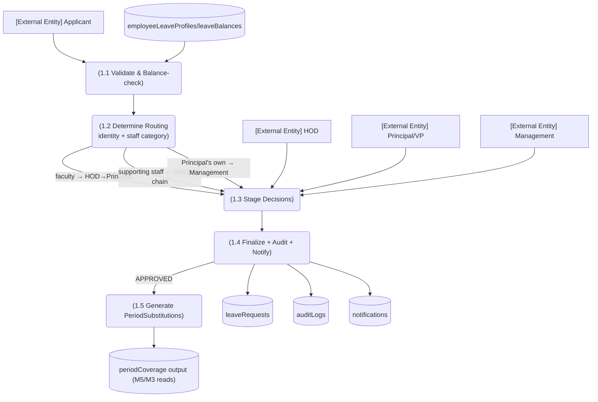

# M6 — DFD Level 2: M6-SM1 Application & Approval Routing

*Evidence: approvalRouting.ts, staffCategoryRouting.test.ts, identity.ts:47-114, decideFinalStage.ts:93, management/leave-approvals sanctioned write (verifySession.ts:84-91).*
