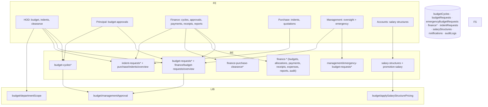

# M7 — Architecture (as-is)

## Frontend
- **HOD:** budget request wizard (`/hod/budget`, `[id]`, report), indents (`/hod/indents`, `[id]`, IndentForm), purchase-clearance (list/[id]/new).
- **Principal/VP:** budget approve/return (`/principal/budget*`, report), indents, purchase-clearance; department budget views.
- **Finance (30 pages):** budget-cycles, budget/new + revise + report, budget-approvals (+new), expense-requests, fund-allocation (+new/edit), payments (+process), receipts, purchase-clearance, indent-approvals, reports, audit, browse (college/location drill).
- **Purchase (16 pages):** indents (+[id]), pending, latest, by-category, by-type, clearance/[id], browse.
- **Management:** budget overview (+[collegeId] drill), emergency approvals (`EmergencyBudgetRequests.tsx`), indents read.
- **Accounts:** salary-structures (new/edit/[id]).

## Backend
- Budget request machine: budget.ts:6-22 — HOD fills auto-created request (PENDING_SUBMISSION from cycle approval) → PENDING_PRINCIPAL_VERIFICATION → L1_FROZEN (Principal verify) → Finance APPROVED (auto-creates FinanceBudget) / REJECTED / RETURNED_TO_HOD; emergency lane: Principal/VP → PENDING_MANAGEMENT_APPROVAL → Finance (management/emergency-budget-requests PATCH sanctioned — verifySession.ts:84-91).
- `managementApproval.ts`: notification + budgetRequests ref (:39) + auditLogs (:66) + FINANCE lookups via colleges users where role==FINANCE (:96-97) — note FINANCE is GLOBAL; this query targets college users → notifyRole's GLOBAL handling exists in notify.ts; potential duplicate/miss `[UNVERIFIED]`.
- departmentScope.ts: user doc reads (:15,:36) for HOD dept narrowing.
- Indent machine: indent.ts:36-48 — GOODS: HOD→Purchase (≥3 quotations + 1 selected)→Finance→APPROVED (FinancePayment auto-created "green flag")→COMPLETED (GRN upload); NON_GOODS: HOD→Finance directly; returns at multiple stages.
- Purchase clearance: `finance-purchase-clearance` (+[id]) — Finance-side clearance records.
- Salary: salary-structures CRUD + `applySalaryStructurePricing.ts` (structures ref :44, faculty ref :58) applied via promotion-salary routes.
- Overview endpoints: `finance/budget-requests/overview`, `purchase/indents/overview` (requireRole FINANCE/PURCHASE_DEPT — GLOBAL dashboards across colleges).

## Data
- Collections listed in README; budget index: budgetRequests COLLECTION_GROUP [status] (global Finance boards); finance reports export via exceljs.

## Integration
- Uploads: budget-circular, budget-report, finance-receipt, indent-receipt, purchase-grn.
- Email/notifications: notify.ts (built for these flows — module comment :9-16).
- Excel export: finance reports.

## Security
- requireCollegeContext for finance-* (global role + college param — the 31 call-sites surface), requireRole for overview endpoints, requireManagement for emergency PATCH.

## Mermaid — component diagram

