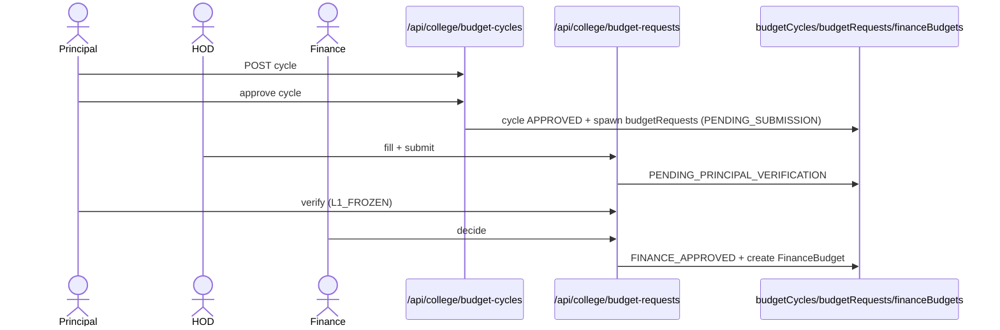
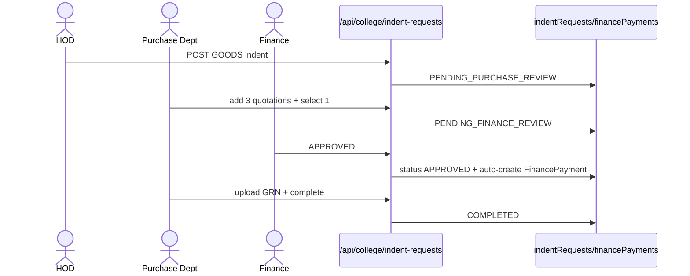

# M7 — Data Flow (as-is)

## M7-SM1 Budget cycle → request → FinanceBudget

**Actors:** Principal (cycle), HOD (fill), Principal/VP (verify), Finance (decide).
**Flow:**
1. `POST /api/college/budget-cycles` → PENDING_APPROVAL (BudgetCycleStatus budget.ts:132) → Principal APPROVED → auto-creates `budgetRequests` per department with status PENDING_SUBMISSION (comment :8).
2. HOD fills items (categories RECURRING/NON_RECURRING :35-45) → submit → PENDING_PRINCIPAL_VERIFICATION.
3. Principal verify → L1_FROZEN (queued for Finance) or RETURNED_TO_PRINCIPAL? no — RETURNED_TO_HOD; or PRINCIPAL_REJECTED.
4. Finance decide → FINANCE_APPROVED (auto-creates FinanceBudget) or FINANCE_REJECTED.
**Emergency lane:** Principal/VP submits isEmergency request → PENDING_MANAGEMENT_APPROVAL → Management PATCH (sanctioned) → Finance.

## M7-SM4 Indent (goods lane)

**Actors:** HOD, Purchase Dept, Finance.
**Flow:** HOD submits GOODS indent → PENDING_PURCHASE_REVIEW → Purchase adds ≥3 quotations + selects 1 → PENDING_FINANCE_REVIEW → Finance APPROVED (auto-creates FinancePayment) → Purchase buys + uploads GRN → COMPLETED. Returns: RETURNED_TO_HOD (purchase/finance), RETURNED_TO_PURCHASE (finance), REJECTED_BY_PURCHASE, REJECTED (finance). NON_GOODS: HOD → PENDING_FINANCE_REVIEW directly → Finance approves & disburses → COMPLETED.

## M7-SM3 Finance ledger
Fund allocations against FinanceBudget → payments (process at `/finance/payments/[id]/process`) → receipts (uploads) → expense requests; reports aggregate; finance-audit-logs stream.

## M7-SM5 Salary structures
Accounts defines structures (per designation bands) → `applySalaryStructurePricing` maps faculty (:44-58) → promotion-salary routes update faculty pay on promotion.

## Error paths
Terminal rejections; returns allow edit+resubmit; 25th payroll lock on manual attendance ties M5→M7 payroll cut-off.
