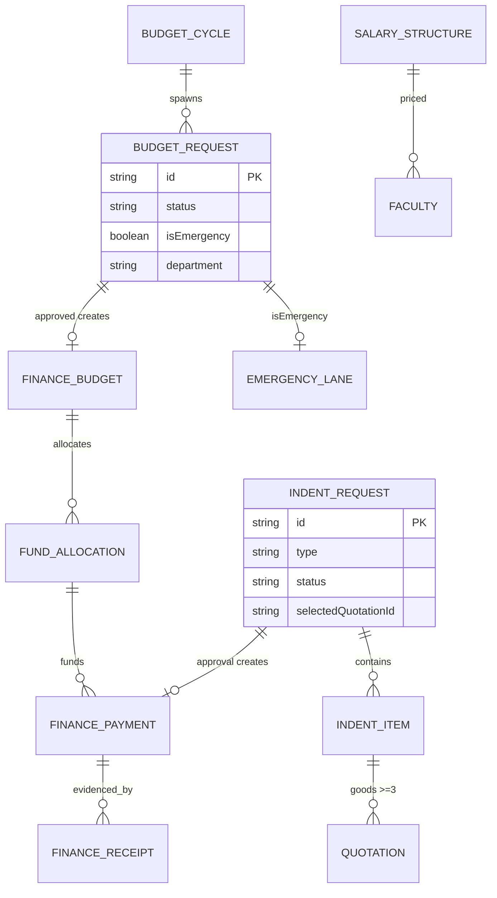

# M7 — Data Model (as-is)

## Entities

| Entity | Path | Key fields/enums | Evidence |
|---|---|---|---|
| BudgetCycle | `budgetCycles/{id}` | status PENDING_APPROVAL/APPROVED/REJECTED/RETURNED (budget.ts:132), daysRemaining | budget.ts:132 |
| BudgetRequest | `budgetRequests/{id}` | 10-state status (budget.ts:6-22), isEmergency (emergency lane), items by category, dept scope | budget.ts:6+ |
| EmergencyBudgetRequest | via budgetRequests isEmergency (management routes read same store) `[UNVERIFIED separate collection]` | | |
| FinanceBudget | `financeBudgets/{id}` | created from FINANCE_APPROVED request | budget.ts:19 comment |
| FinanceFundAllocation / Payment / Receipt / ExpenseRequest | `finance*` | amounts, status, attachments | routes |
| IndentRequest | `indentRequests/{id}` | type GOODS/NON_GOODS (indent.ts labels:2-5), 8-state status (:36-48), items, quotations, selectedQuotation | indent.ts |
| PurchaseClearance | `financePurchaseClearance/{id}` | Finance-side clearance | routes |
| SalaryStructure | `salaryStructures/{id}` | designation bands; applied to faculty | applySalaryStructurePricing.ts:44-58 |
| FinancialYear | `financialYears/{id}` | year ranges | routes |

## Mermaid ER

## Indexes
- budgetRequests COLLECTION_GROUP [status] (global Finance board); salaryRecords [facultyId,year↓,month↓], [department,status,year↓] (payroll history reads).
