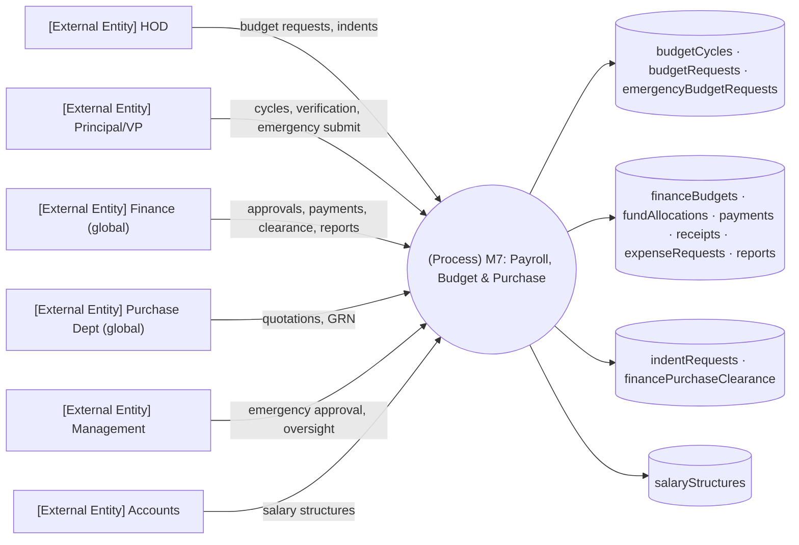

# M7 — DFD Level 0 (context)

```mermaid
flowchart LR
    HOD["[External Entity] HOD"]
    PR["[External Entity] Principal/VP"]
    FIN["[External Entity] Finance (global)"]
    PUR["[External Entity] Purchase Dept (global)"]
    MGMT["[External Entity] Management"]
    ACC["[External Entity] Accounts"]

    M7(("(Process) M7: Payroll, Budget & Purchase"))

    DB[("budgetCycles · budgetRequests · emergencyBudgetRequests")]
    DF[("financeBudgets · fundAllocations · payments · receipts · expenseRequests · reports")]
    DI[("indentRequests · financePurchaseClearance")]
    DS[("salaryStructures")]

    HOD -->|"budget requests, indents"| M7
    PR -->|"cycles, verification, emergency submit"| M7
    FIN -->|"approvals, payments, clearance, reports"| M7
    PUR -->|"quotations, GRN"| M7
    MGMT -->|"emergency approval, oversight"| M7
    ACC -->|"salary structures"| M7
    M7 --> DB
    M7 --> DF
    M7 --> DI
    M7 --> DS
```
