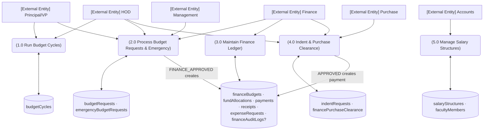

# M7 — DFD Level 1

```mermaid
flowchart TD
    HOD["[External Entity] HOD"]
    PR["[External Entity] Principal/VP"]
    FIN["[External Entity] Finance"]
    PUR["[External Entity] Purchase"]
    MGMT["[External Entity] Management"]
    ACC["[External Entity] Accounts"]

    P1("(1.0 Run Budget Cycles)")
    P2("(2.0 Process Budget Requests & Emergency)")
    P3("(3.0 Maintain Finance Ledger)")
    P4("(4.0 Indent & Purchase Clearance)")
    P5("(5.0 Manage Salary Structures)")

    D1[("budgetCycles")]
    D2[("budgetRequests · emergencyBudgetRequests")]
    D3[("financeBudgets · fundAllocations · payments · receipts · expenseRequests · financeAuditLogs?")]
    D4[("indentRequests · financePurchaseClearance")]
    D5[("salaryStructures · facultyMembers")]

    HOD-->P1; PR-->P1; P1<-->D1
    HOD-->P2; PR-->P2; FIN-->P2; MGMT-->P2; P2<-->D2
    FIN-->P3; P3<-->D3
    HOD-->P4; PUR-->P4; FIN-->P4; P4<-->D4
    ACC-->P5; P5<-->D5
    P2-->|"FINANCE_APPROVED creates"|D3
    P4-->|"APPROVED creates payment"|D3
```
