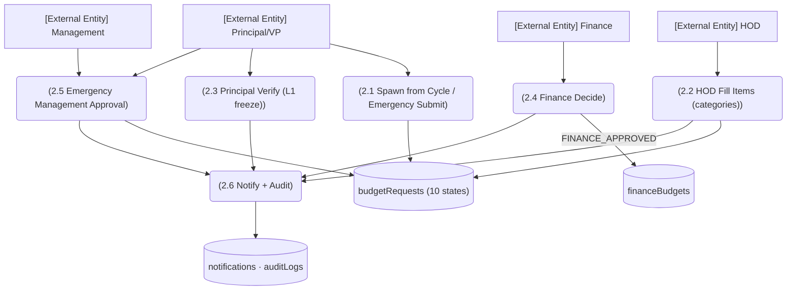

# M7 — DFD Level 2: M7-SM1/SM2 Budget Request Lifecycle

*Evidence: budget.ts:6-22 (states incl. emergency lane + isEmergency), managementApproval.ts:18-97 (notify :18, ref :39, audit :66, FINANCE lookup :96-97), management emergency PATCH sanctioned (verifySession.ts:84-91).*
