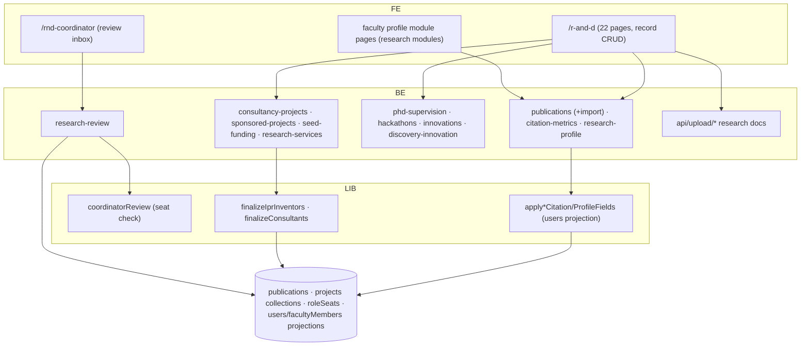

# M8 — Architecture (as-is)

## Frontend
- `/r-and-d` home + 21 sub-pages: list/CRUD per record type; `record/[module]/[id]` generic detail renderer; publications have dedicated new/edit/import flows.
- `/rnd-coordinator` (seat holders): review inbox (submissions from their department pending review before R&D sees them — coordinatorReview.ts).
- Faculty-facing: profile module editor pages (`/hod/faculty/[id]/[module]`, `/principal/staff/[uid]/[module]`, etc.) render research records read-only/editable per module assignment.

## Backend
- Standard route handlers per record type with `requireCollegeMember`; `[id]` routes for update/delete; `[uid]` routes for per-faculty views.
- Projection libs: citation metrics and research profile fields are *applied onto* `users` docs (applyCitationMetricsFields.ts:36-37, applyResearchProfileFields.ts:37) after reading the faculty member by `userUid` (:31-32) — a denormalized read-model pattern.
- finalize* libs resolve inventors/consultants against facultyMembers (`where userUid`) before persisting records (:19-28).
- Coordinator review: `research-review` route + coordinatorReview.ts — checks `roleSeats` for the reviewer's RND_COORDINATOR seat (:51), resolves faculty/user for context (:75-79), then forwards/returns submissions.
- Owner designation resolution: resolveOwnerDesignation.ts (:23), flat-field derivation for listings (deriveFlatFields.ts:26-34).

## Data
- One collection per record type (college-scoped); publications support Excel import; ownership via uid; citations/profiles projected onto users.
- Uploads: consultancy-doc, sponsored-project-doc, seed-funding-doc, research-service-doc, hackathon-doc, innovation-doc, ipr-doc, phd-doc (`api/upload/*`).

## Security/tenancy
- College-scoped guards; RND_COORDINATOR is a seat (`types/core.ts:52-55` comment: "Per-department seat: first-level reviewer… before they reach R&D"), resolved live via roleSeats; faculty self-edit own records via `[uid]` ownership checks `[UNVERIFIED exact]`.

## Mermaid — component diagram

