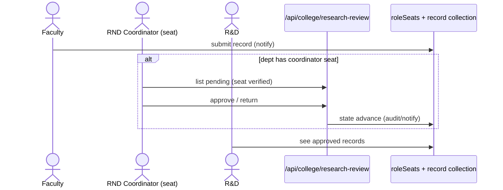

# M8 — Data Flow (as-is)

## M8-SM1 Publications
**Actors:** faculty (self), R_AND_D (all), import.
**Flow:** create/edit via `/r-and-d/publications*` → `POST /api/college/publications` (owner uid) → Excel import route for bulk → listing derives flat fields (deriveFlatFields.ts) + owner designation (resolveOwnerDesignation.ts:23) → notification to R&D on submit (`notify` referencedBy publications/[id]).
Citations: `citation-metrics` POST updates metrics and projects onto `users` (applyCitationMetricsFields.ts:31-37); `[uid]` route reads per-faculty.

## M8-SM5 RND Coordinator review
**Actors:** RND_COORDINATOR seat holder (department), R_AND_D.
**Flow:** faculty submits record (any research type) → if department has a coordinator seat filled, submission enters review state → `GET/POST /api/college/research-review` (seat check coordinatorReview.ts:51) → approve → reaches R&D; return → back to faculty. Seat-free departments go straight to R&D `[ASSUMPTION — verify route]`.

## M8-SM3/SM4 Projects & activities
Same CRUD + doc uploads + notify-on-decision pattern per `[id]` route (notify referencedBy for consultancy-projects, discovery-innovation, hackathons, innovations, phd-supervision, research-services, seed-funding, sponsored-projects, research-profile). finalize* libs resolve people fields against facultyMembers before save.

## Error paths
Ownership mismatch → 403; invalid uid refs → 400; import row errors → report `[UNVERIFIED format]`.
