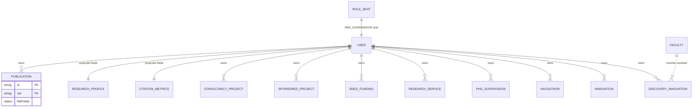

# M8 — Data Model (as-is)

## Entities (college-scoped; ownership via uid)

| Entity | Path | Notes | Evidence |
|---|---|---|---|
| Publication | `publications/{id}` | owner uid; flat fields derived for lists; Excel import | publications.ts:9; deriveFlatFields.ts:26-34 |
| CitationMetrics | projected onto `users/{uid}` (dedicated collection `[UNVERIFIED]`) | applied by lib | applyCitationMetricsFields.ts:22-37 |
| ResearchProfile | projected onto `users/{uid}` | same pattern | applyResearchProfileFields.ts:22-37 |
| ConsultancyProject / SponsoredProject / SeedFunding / ResearchService | same-named collections | consultants resolved vs facultyMembers | finalizeConsultants.ts:20 |
| PhdSupervision / Hackathon / Innovation / DiscoveryInnovation | same-named | inventors resolved vs facultyMembers | finalizeIprInventors.ts:19-28 |
| RoleSeat | `roleSeats` | RND_COORDINATOR seat (core.ts:52-55) | coordinatorReview.ts:51 |

## Mermaid ER

*Projection pattern: citations/profile live as fields on users docs (libs update them) rather than separate collections — read-model denormalization `[UNVERIFIED whether separate collections also exist]`.*
