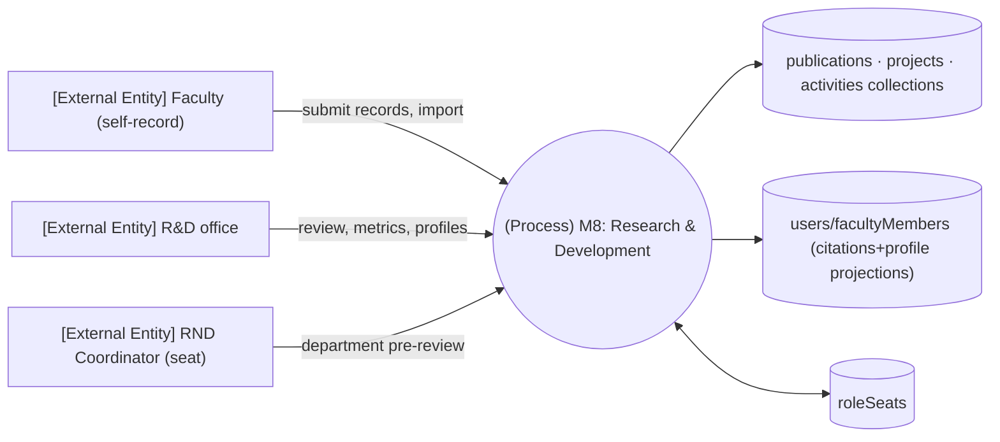

# M8 — DFD Level 0 (context)

```mermaid
flowchart LR
    FAC["[External Entity] Faculty (self-record)"]
    RND["[External Entity] R&D office"]
    CO["[External Entity] RND Coordinator (seat)"]

    M8(("(Process) M8: Research & Development"))

    DR[("publications · projects · activities collections")]
    DU[("users/facultyMembers (citations+profile projections)")]
    DS[("roleSeats")]

    FAC -->|"submit records, import"| M8
    RND -->|"review, metrics, profiles"| M8
    CO -->|"department pre-review"| M8
    M8 --> DR
    M8 --> DU
    M8 <--> DS
```
