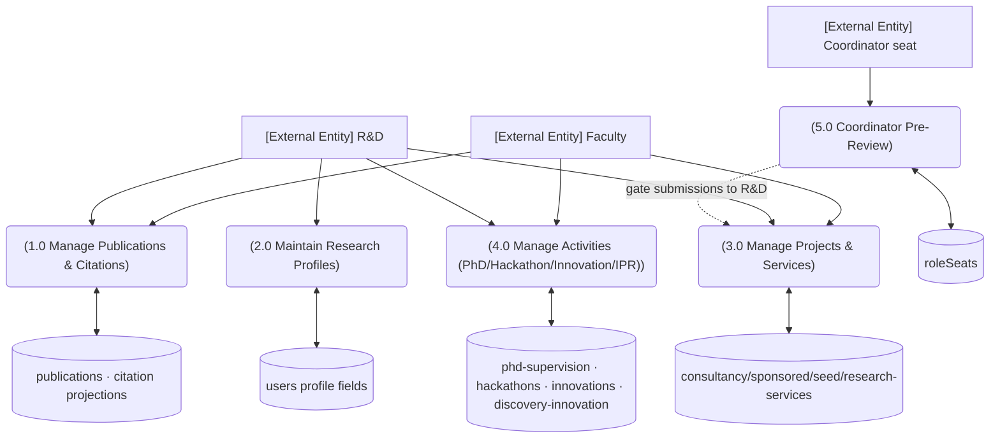

# M8 — DFD Level 1

```mermaid
flowchart TD
    FAC["[External Entity] Faculty"]
    RND["[External Entity] R&D"]
    CO["[External Entity] Coordinator seat"]

    P1("(1.0 Manage Publications & Citations)")
    P2("(2.0 Maintain Research Profiles)")
    P3("(3.0 Manage Projects & Services)")
    P4("(4.0 Manage Activities (PhD/Hackathon/Innovation/IPR))")
    P5("(5.0 Coordinator Pre-Review)")

    D1[("publications · citation projections")]
    D2[("users profile fields")]
    D3[("consultancy/sponsored/seed/research-services")]
    D4[("phd-supervision · hackathons · innovations · discovery-innovation")]
    D5[("roleSeats")]

    FAC-->P1; RND-->P1; P1<-->D1
    RND-->P2; P2<-->D2
    FAC-->P3; RND-->P3; P3<-->D3
    FAC-->P4; RND-->P4; P4<-->D4
    CO-->P5; P5<-->D5; P5-.->|"gate submissions to R&D"|P3
```
