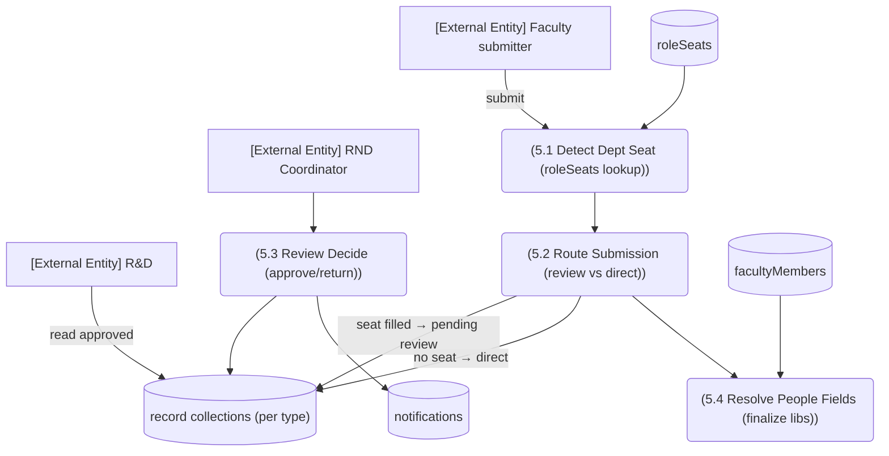

# M8 — DFD Level 2: M8-SM5 RND Coordinator Review

```mermaid
flowchart TD
    FAC["[External Entity] Faculty submitter"]
    CO["[External Entity] RND Coordinator"]
    RND["[External Entity] R&D"]

    P51("(5.1 Detect Dept Seat (roleSeats lookup))")
    P52("(5.2 Route Submission (review vs direct))")
    P53("(5.3 Review Decide (approve/return))")
    P54("(5.4 Resolve People Fields (finalize libs))")

    DS[("roleSeats")]
    DR[("record collections (per type)")]
    DF[("facultyMembers")]
    DN[("notifications")]

    FAC-->|"submit"|P51
    DS-->P51
    P51-->P52
    P52-->|"seat filled → pending review"|DR
    P52-->|"no seat → direct"|DR
    CO-->P53-->DR
    P53-->DN
    P52-->P54
    DF-->P54
    RND-->|"read approved"|DR
```

*Evidence: coordinatorReview.ts:51 (roleSeats), :75-79 (faculty/user resolution); finalizeIprInventors.ts:19-28; finalizeConsultants.ts:20.*
