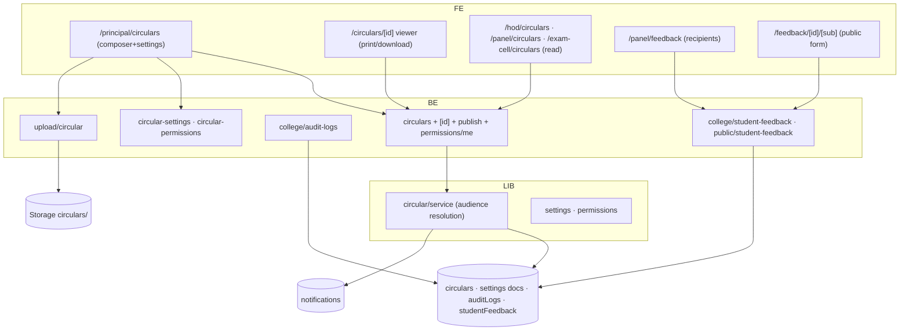

# M9 — Architecture (as-is)

## Frontend
- Circular composer: CircularForm (employeeType/departments/date/subject/body/messageFrom/FileUpload — AGENTS.md) at `/principal/circulars`; draft/publish buttons.
- Viewer: CircularCard lists; click → `/circulars/[id]` page with print/download (same HTML as circular print).
- Nav: Megaphone icon for PRINCIPAL/HOD/PANEL_MEMBER (navConfig); Exam Cell circulars (exam module's own circulars — M3 boundary).
- Feedback: `/panel/feedback` (recipient view); public giver at `/feedback/[id]/[sub]` (+`/[item]`).

## Backend
- `service.ts`: circulars collection ref (:11); publish flow flips status + `notifyAudience` → CIRCULAR_PUBLISHED with link `/circulars/{id}` (AGENTS.md circulars section); audience resolution reads college `users` (:141-149) and REGULAR `students` (:176-183) for fan-out targeting.
- `settings.ts`/`permissions.ts`: settings + permission docs (allowedUids/allowedRoles — PRINCIPAL/VP always allowed).
- `permissions/me`: current user's circular rights.
- `audit-logs`: college stream read (writes scattered per-flow across modules — M1-SM4 shared).
- `student-feedback`: public POST (proxy public path `/feedback`) + college GET for panel recipients.

## Data
- `circulars` docs per college; settings doc `settings/{SETTINGS_DOC}` (settings.ts:10) + permissions doc (permissions.ts:12); `studentFeedback` (indexed [candidateId, submittedAt↓] — note: that index is for hiring demo feedback; student feedback shape `[UNVERIFIED]`).

## Integration
- `upload/circular` → Storage `colleges/{id}/circulars/`; notifications via notify; PDF/print via shared HTML (jspdf/html2canvas client).

## Security
- Create gated by CircularPermissionsDoc (role allow-list + uid allow-list; Principal/VP implicit); publish gated further; viewer public-ish via dashboard auth; feedback public with tokenized path `[UNVERIFIED token model]`.

## Mermaid — component diagram

