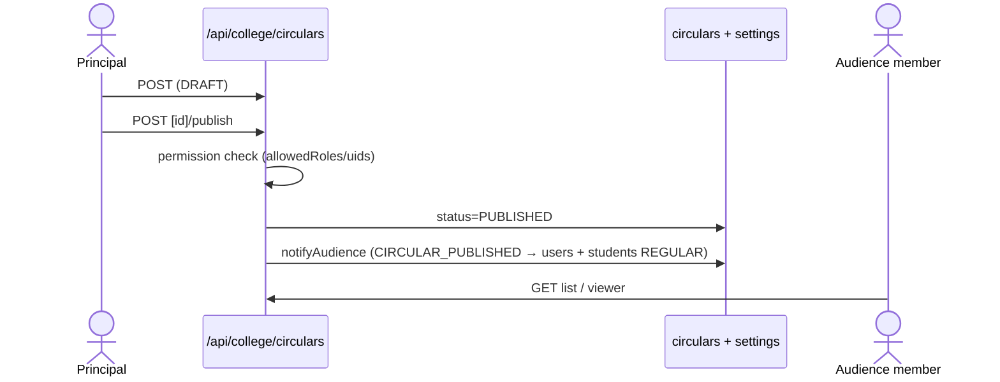

# M9 — Data Flow (as-is)

## M9-SM1 Circular draft → publish

**Actors:** Principal/VP (always allowed), allow-listed roles/uids (CircularPermissionsDoc).
**Flow:**
1. Configure: `PUT circular-settings` (messageFrom options), `PUT circular-permissions` (allow-lists).
2. Compose: `POST /api/college/circulars` {subject, body, date, audience{employeeType, departmentIds}, messageFrom, attachments} → DRAFT.
3. Publish: `POST circulars/[id]/publish` → permission re-check → status PUBLISHED → `notifyAudience` writes CIRCULAR_PUBLISHED notifications (link `/circulars/{id}`) resolving audience across `users` (:141-149) and REGULAR students (:176-183).
4. Read: role dashboards list published; `/circulars/[id]` viewer with print/download.

## M9-SM3 Student feedback
**Actors:** student (public), PANEL_MEMBER recipient.
**Flow:** student opens `/feedback/[id]/[sub]` (tokenized) → `POST /api/public/student-feedback` → `studentFeedback` doc → panel recipient lists via `/api/college/student-feedback` → `/panel/feedback`.

## M9-SM2 Audit logs
Writes: scattered per-flow (M1-SM4 shared); Reads: Principal `/principal/audit-logs` → `GET college/audit-logs`; compliance export absent `[GAP]`.
