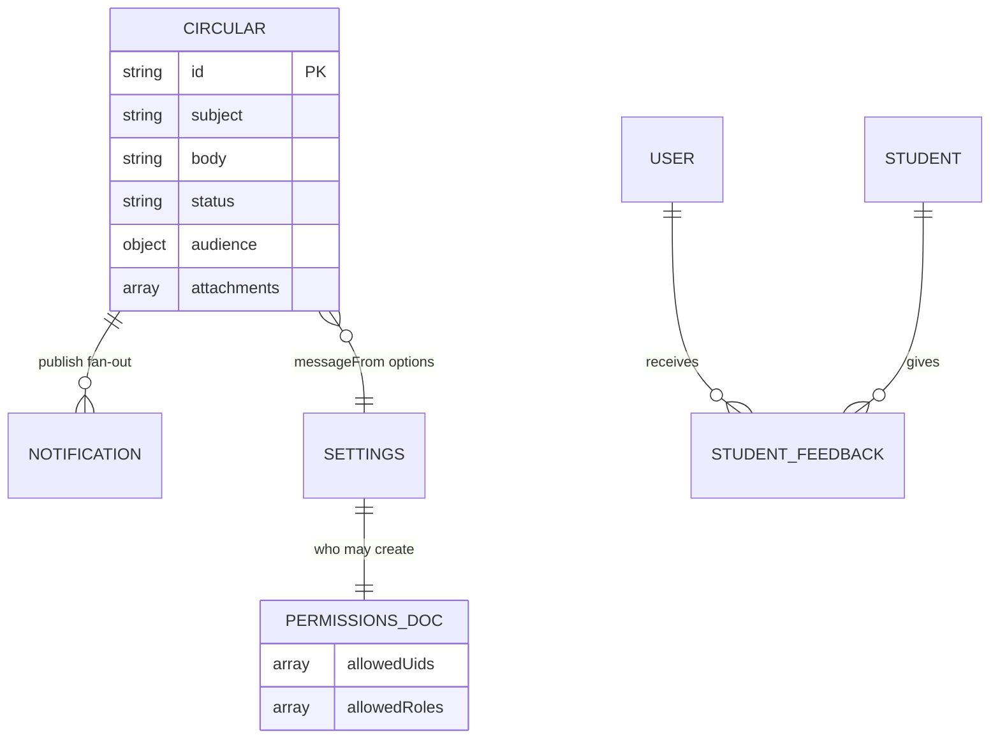

# M9 — Data Model (as-is)

## Entities (types/circular.ts)

| Entity | Path | Key fields | Evidence |
|---|---|---|---|
| Circular | `colleges/{id}/circulars/{id}` | subject, body, date, audience{employeeType, departmentIds}, messageFrom, attachments[], status DRAFT\|PUBLISHED | AGENTS.md circulars; service.ts |
| CircularSettings | `colleges/{id}/settings/{SETTINGS_DOC}` | messageFromOptions (Management/Principal/Academics/HOD defaults; Principal-editable) | settings.ts:10 |
| CircularPermissionsDoc | `colleges/{id}/settings/{PERMS_DOC}` | allowedUids[], allowedRoles[] | permissions.ts:12 |
| StudentFeedback | `colleges/{id}/studentFeedback/{id}` | faculty target, ratings/comments, student ref | routes |
| AuditLog | `colleges/{id}/auditLogs/{id}` | shared M1 | M1 docs |

## Mermaid ER

## Notes
- No department subcollection; audience departments array on doc. Exam circulars are a separate M3 collection (parallel system).
