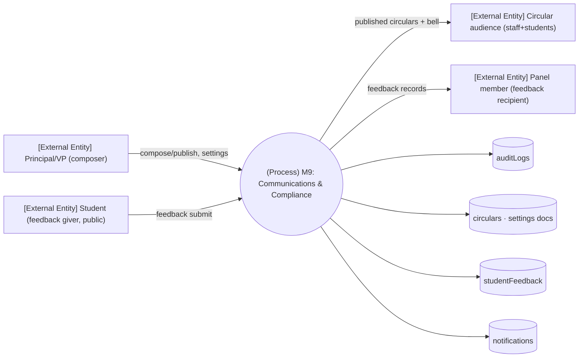

# M9 — DFD Level 0 (context)

```mermaid
flowchart LR
    P["[External Entity] Principal/VP (composer)"]
    R["[External Entity] Circular audience (staff+students)"]
    S["[External Entity] Student (feedback giver, public)"]
    PM["[External Entity] Panel member (feedback recipient)"]

    M9(("(Process) M9: Communications & Compliance"))

    DC[("circulars · settings docs")]
    DA[("auditLogs")]
    DF[("studentFeedback")]
    DN[("notifications")]

    P -->|"compose/publish, settings"| M9
    M9 -->|"published circulars + bell"| R
    S -->|"feedback submit"| M9
    M9 -->|"feedback records"| PM
    M9 --> DA
    M9 --> DC
    M9 --> DF
    M9 --> DN
```
