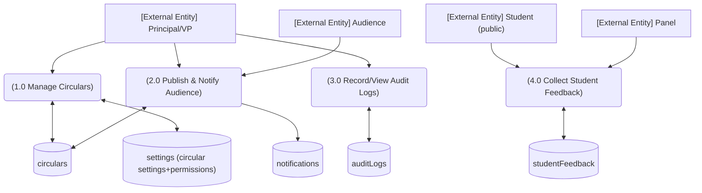

# M9 — DFD Level 1

```mermaid
flowchart TD
    P["[External Entity] Principal/VP"]
    R["[External Entity] Audience"]
    S["[External Entity] Student (public)"]
    PM["[External Entity] Panel"]

    P1("(1.0 Manage Circulars)")
    P2("(2.0 Publish & Notify Audience)")
    P3("(3.0 Record/View Audit Logs)")
    P4("(4.0 Collect Student Feedback)")

    D1[("circulars")]
    D2[("settings (circular settings+permissions)")]
    D3[("auditLogs")]
    D4[("studentFeedback")]
    D5[("notifications")]

    P-->P1; P1<-->D1; P1<-->D2
    P-->P2; P2<-->D1; P2-->D5; R-->P2
    P-->P3; P3<-->D3
    S-->P4; P4<-->D4; PM-->P4
```
