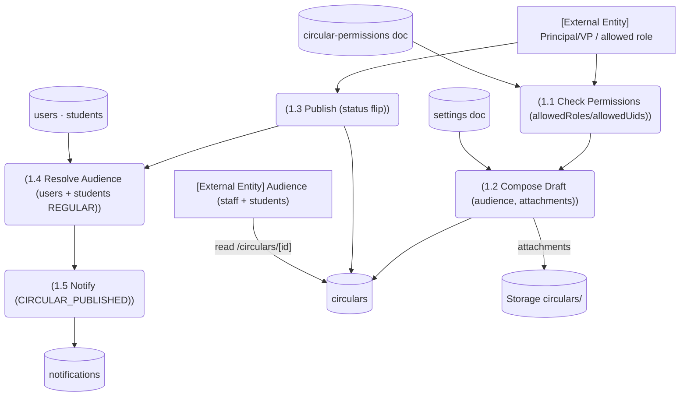

# M9 — DFD Level 2: M9-SM1 Circular Compose & Publish

*Evidence: service.ts:11 (ref), :141-149 (users), :176-183 (students REGULAR); settings.ts:10; permissions.ts:12; notifyAudience + CIRCULAR_PUBLISHED link per AGENTS.md circulars.*
