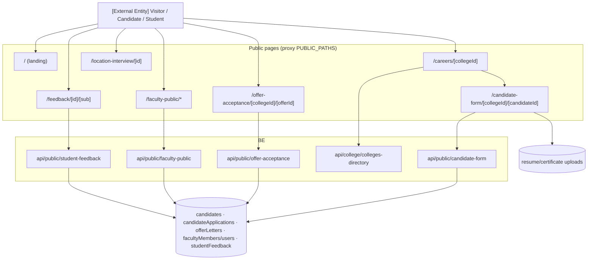

# M10 — Architecture (as-is)

## Frontend
- Landing page `/` (marketing) with client redirect for signed-in users (proxy.ts:9-12 comment).
- `/careers/[collegeId]`: vacancy list for college → deep link to candidate form.
- `/candidate-form/[collegeId]/[candidateId]`: multi-step application (personal, resume upload).
- `/offer-acceptance/[collegeId]/[offerId]`: terms snapshot display + accept/decline + joining-date confirm.
- `/faculty-public/[param]`: public faculty profile (research, qualifications); `/faculty-public/demo` demo route.
- `/location-interview/[id]`: candidate self check-in for location (offline) interviews.
- `/feedback/[id]/[sub]`: student feedback wizard (M9).

## Backend
- 4 public API routes (`api/public/*`) + shared college directory read. All bypass proxy (`/api/` skip — proxy.ts:104-106) and rely on their own token/id validation `[UNVERIFIED depth]`.
- Uploads: public resume/certificate variants `[UNVERIFIED which upload routes allow public]`.

## Data
- Writes into M2 stores (candidates/applications/offerLetters responses); reads faculty for public profiles.

## Security
- No session; identifier-in-path acts as capability token. Risks: enumeration (sequential ids?), no captcha/rate-limit found `[GAP]`.

## Mermaid — component diagram

