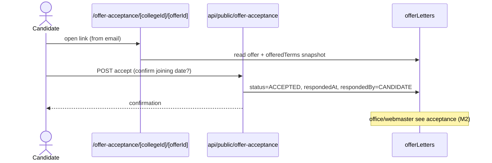

# M10 — Data Flow (as-is)

## M10-SM1 Candidate application (→ M2)
Visitor browses `/careers/[collegeId]` → picks vacancy → fills `/candidate-form/[collegeId]/[candidateId]` → `POST api/public/candidate-form/...` creates candidate+application (source CAREERS_PAGE) → resume upload → notify HOD (M2 flow M2-F2). Sync; errors 400/404.

## M10-SM3 Offer acceptance (→ M2)
Candidate receives email link `/offer-acceptance/[collegeId]/[offerId]` → views offeredTerms snapshot → accept/decline → `POST api/public/offer-acceptance/[collegeId]/[offerId]` → offerLetters.status ACCEPTED|REJECTED, respondedBy=CANDIDATE → office notified (M2 flow M2-F3).

## M10-SM4 Faculty public profile
Visitor/college shares `/faculty-public/[param]` → `GET api/public/faculty-public` reads facultyMembers/users + research projections (M8) → renders read-only profile. `[UNVERIFIED param → faculty resolution]`

## M10-SM5 Location interview
Candidate opens `/location-interview/[id]` (from interview comms) → self check-in against location interview schedule (M2 location flow) `[UNVERIFIED backing API]`.

## Error paths
Unknown ids → 404; expired/decided offers → guard; upload failures → retry.
