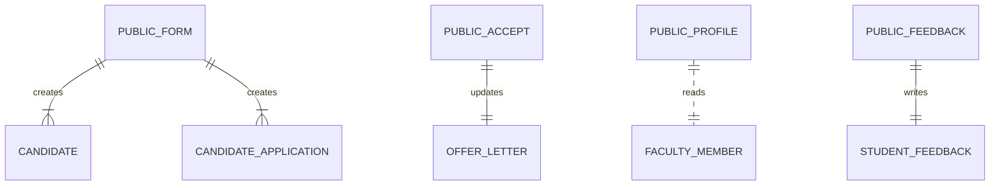

# M10 — Data Model (as-is)

M10 owns no collections — it reads/writes M2/M9 stores through public endpoints.

| Reused store | Written by | Read by |
|---|---|---|
| `candidates`, `candidateApplications` | candidate-form POST | M2 |
| `offerLetters` (status, respondedAt/By, termsAcceptedAt, candidateConfirmedJoiningDate) | offer-acceptance POST | M2 |
| `facultyMembers`, `users` (+M8 projections) | — | faculty-public GET |
| `studentFeedback` | student-feedback POST | M9 |

