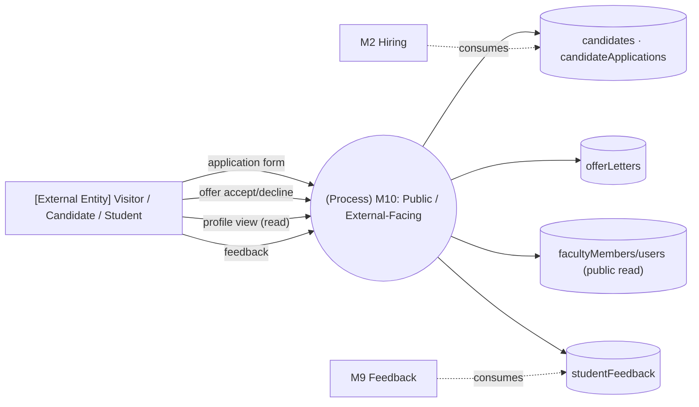
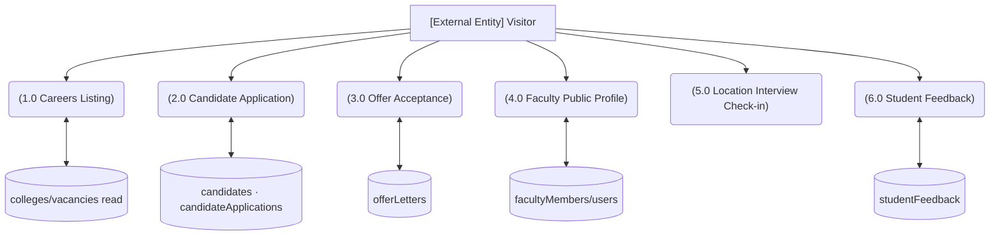

# M10 — DFD Level 0 (context)

```mermaid
flowchart LR
    VIS["[External Entity] Visitor / Candidate / Student"]

    M10(("(Process) M10: Public / External-Facing"))

    DC[("candidates · candidateApplications")]
    DO[("offerLetters")]
    DF[("facultyMembers/users (public read)")]
    DB[("studentFeedback")]

    VIS -->|"application form"| M10
    VIS -->|"offer accept/decline"| M10
    VIS -->|"profile view (read)"| M10
    VIS -->|"feedback"| M10
    M10 --> DC
    M10 --> DO
    M10 --> DF
    M10 --> DB
    M2["M2 Hiring"] -.->|"consumes"| DC
    M9["M9 Feedback"] -.->|"consumes"| DB
```

# M10 — DFD Level 1

```mermaid
flowchart TD
    VIS["[External Entity] Visitor"]
    P1("(1.0 Careers Listing)")
    P2("(2.0 Candidate Application)")
    P3("(3.0 Offer Acceptance)")
    P4("(4.0 Faculty Public Profile)")
    P5("(5.0 Location Interview Check-in)")
    P6("(6.0 Student Feedback)")

    D1[("colleges/vacancies read")]
    D2[("candidates · candidateApplications")]
    D3[("offerLetters")]
    D4[("facultyMembers/users")]
    D5[("studentFeedback")]

    VIS-->P1; P1<-->D1
    VIS-->P2; P2<-->D2
    VIS-->P3; P3<-->D3
    VIS-->P4; P4<-->D4
    VIS-->P5
    VIS-->P6; P6<-->D5
```
