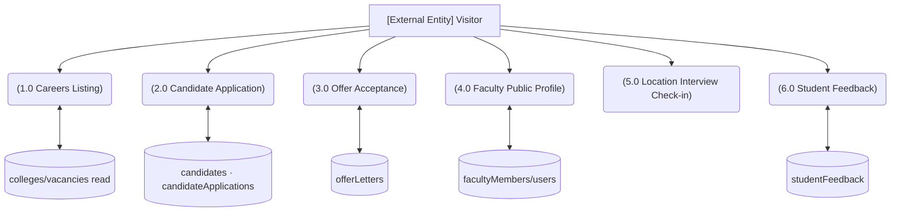

# M10 — DFD Level 1

```mermaid
flowchart TD
    VIS["[External Entity] Visitor"]
    P1("(1.0 Careers Listing)")
    P2("(2.0 Candidate Application)")
    P3("(3.0 Offer Acceptance)")
    P4("(4.0 Faculty Public Profile)")
    P5("(5.0 Location Interview Check-in)")
    P6("(6.0 Student Feedback)")

    D1[("colleges/vacancies read")]
    D2[("candidates · candidateApplications")]
    D3[("offerLetters")]
    D4[("facultyMembers/users")]
    D5[("studentFeedback")]

    VIS-->P1; P1<-->D1
    VIS-->P2; P2<-->D2
    VIS-->P3; P3<-->D3
    VIS-->P4; P4<-->D4
    VIS-->P5
    VIS-->P6; P6<-->D5
```
