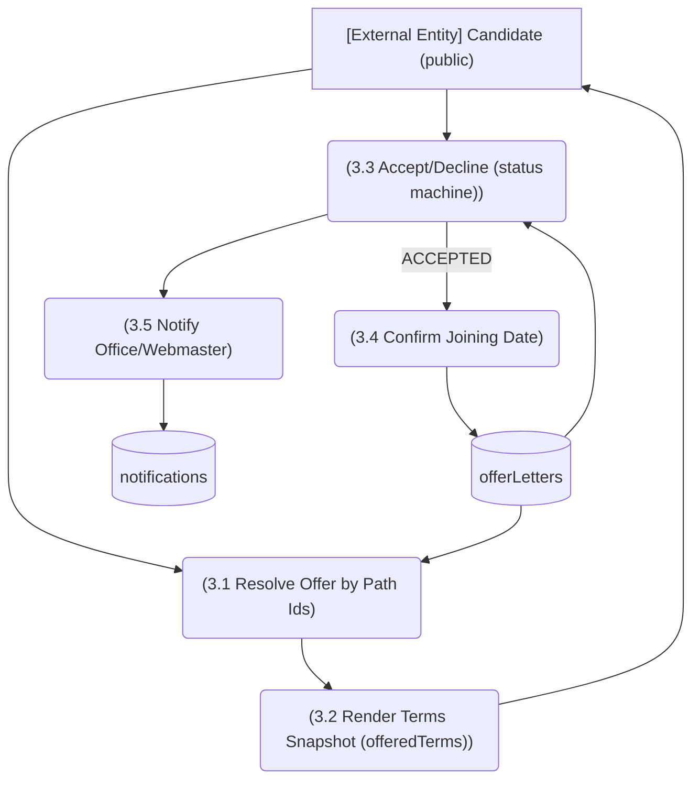

# M10 — DFD Level 2: M10-SM3 Offer Acceptance

*Evidence: `recruitment.ts:458-490` (offeredTerms snapshot, respondedBy=CANDIDATE), `api/public/offer-acceptance/[collegeId]/[offerId]/route.ts`; M2 flow M2-F3.*
