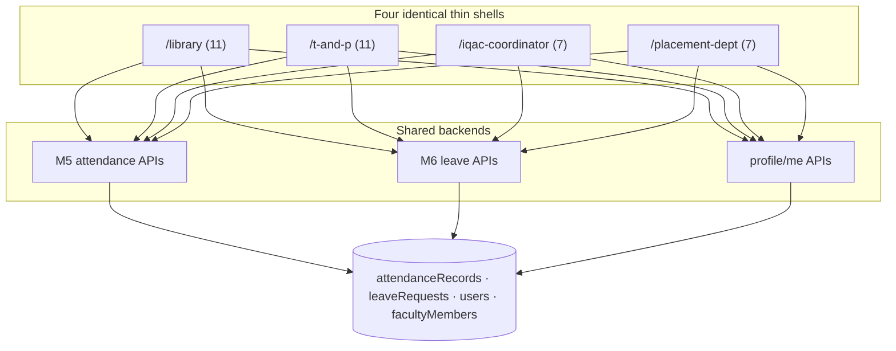

# M11 — Architecture (as-is)

## Frontend
Identical page template per role (page counts differ only by attendance-admin twins):
```text
/<role>                      home
/<role>/attendance           self check-in (M5-SM1 UI)
/<role>/attendance-import    admin import (Library, T&P only)
/<role>/staff-attendance (+[uid])   admin view (Library, T&P only)
/<role>/leave (+apply, history/[type])   M6 self-service
/<role>/profile (+[module], [module]/edit)   profile module editor (M1/M8 rendering)
```
Roles: `library`, `t-and-p`, `iqac-coordinator`, `placement-dept`.

## Backend
No dedicated routes — all calls hit shared M5/M6/profile APIs guarded by `requireCollegeMember` + role checks within those routes (e.g., attendance report role branches).

## Data
Shared stores only; no M11-owned collections.

## Security/tenancy
College-scoped; role exists only for permitted college types (`officeRoles.ts`); proxy grants each role its prefix + `/leave` shared path (proxy.ts ROLE_PATH_MAP lines 62-64, 69-71).

## Mermaid — component diagram


