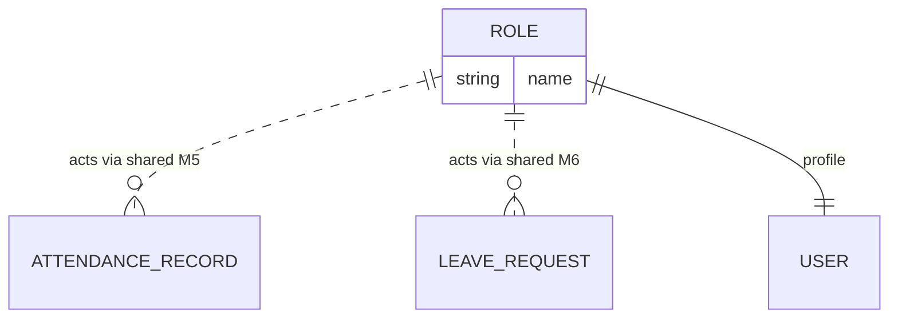

# M11 — Data Model (as-is)

**M11 owns no collections.** All persistence is shared:

| Shared store | Used for |
|---|---|
| `attendanceRecords` | self + dept attendance |
| `leaveRequests`, `leaveBalances`, `employeeLeaveProfiles` | leave self-service |
| `users/{uid}`, `facultyMembers` | profile fields, module assignments |
| M8 projections on users | research module rendering |

College-type gating (`getCreatableOfficeRoles`) controls which colleges can even hold these roles — a data-adjacent rule in `src/lib/roles/officeRoles.ts`.
