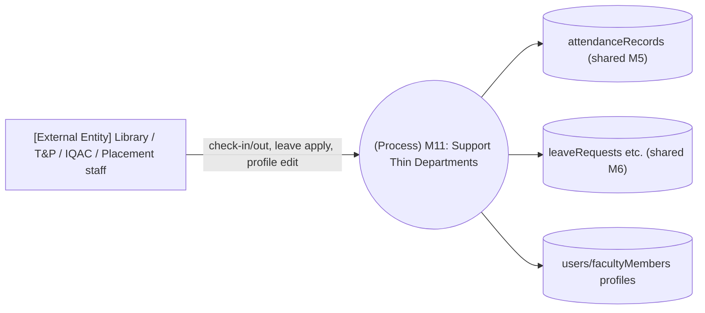
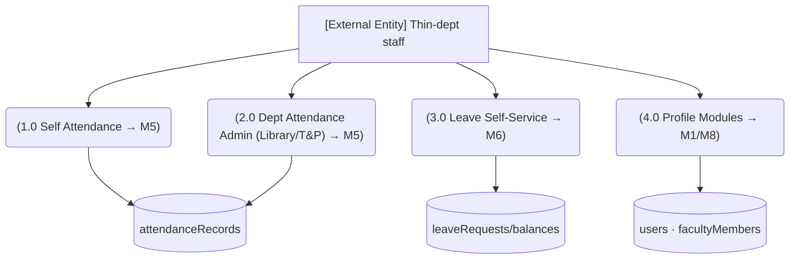

# M11 — DFD Level 0 (context)

```mermaid
flowchart LR
    U["[External Entity] Library / T&P / IQAC / Placement staff"]

    M11(("(Process) M11: Support Thin Departments"))

    DA[("attendanceRecords (shared M5)")]
    DL[("leaveRequests etc. (shared M6)")]
    DP[("users/facultyMembers profiles")]

    U -->|"check-in/out, leave apply, profile edit"| M11
    M11 --> DA
    M11 --> DL
    M11 --> DP
```

# M11 — DFD Level 1

```mermaid
flowchart TD
    U["[External Entity] Thin-dept staff"]
    P1("(1.0 Self Attendance → M5)")
    P2("(2.0 Dept Attendance Admin (Library/T&P) → M5)")
    P3("(3.0 Leave Self-Service → M6)")
    P4("(4.0 Profile Modules → M1/M8)")

    D1[("attendanceRecords")]
    D2[("leaveRequests/balances")]
    D3[("users · facultyMembers")]

    U-->P1-->D1
    U-->P2-->D1
    U-->P3-->D2
    U-->P4-->D3
```
