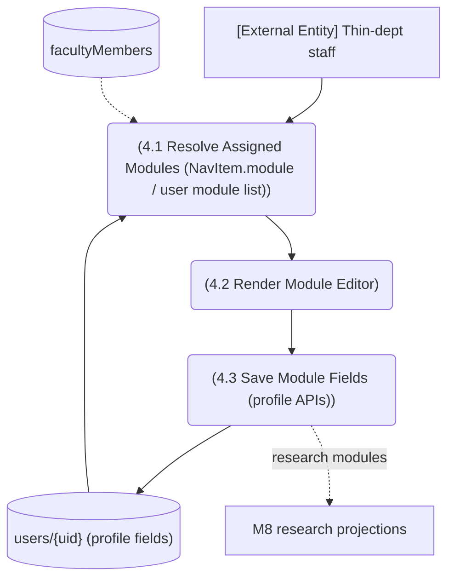

# M11 — DFD Level 2: Profile Module Editing (shared with M1/M8)

*Evidence: profile `[module]` page pattern across role roots; NavItem.module gating (navConfig.ts:12-21); M8 projection libs write users fields.*
