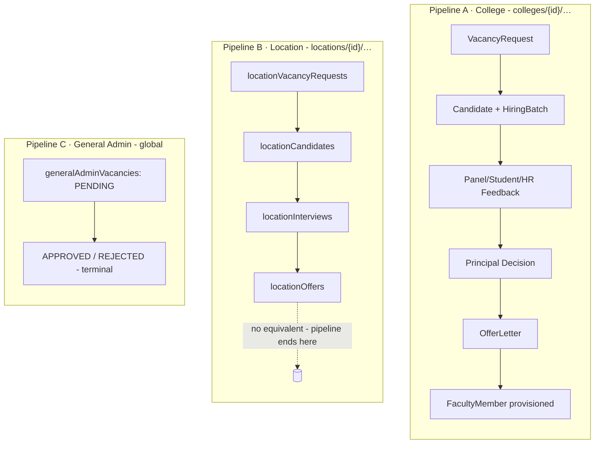
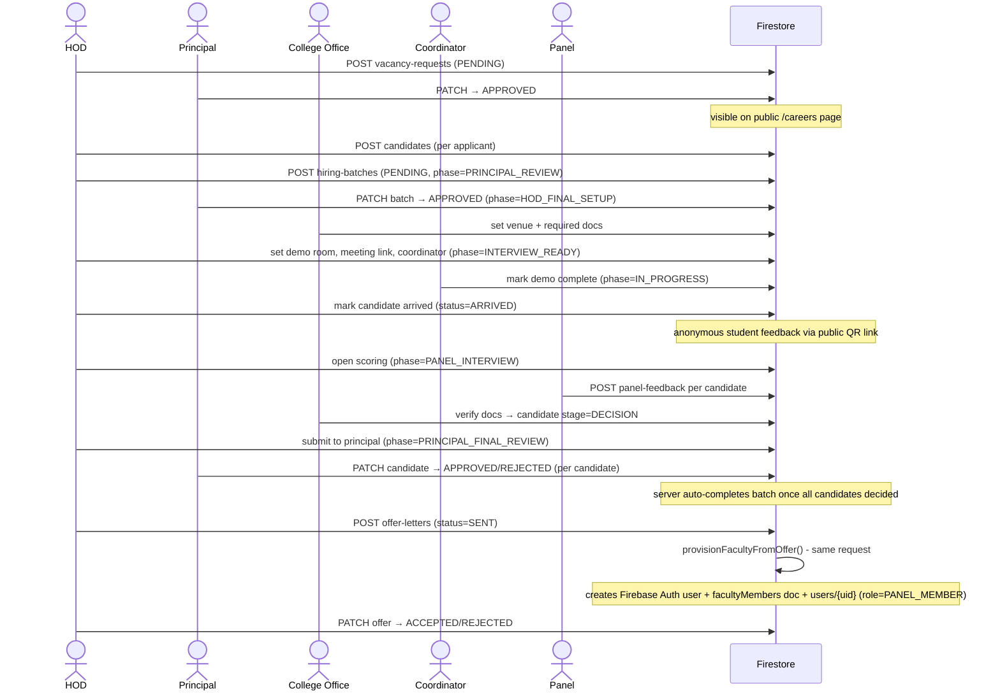
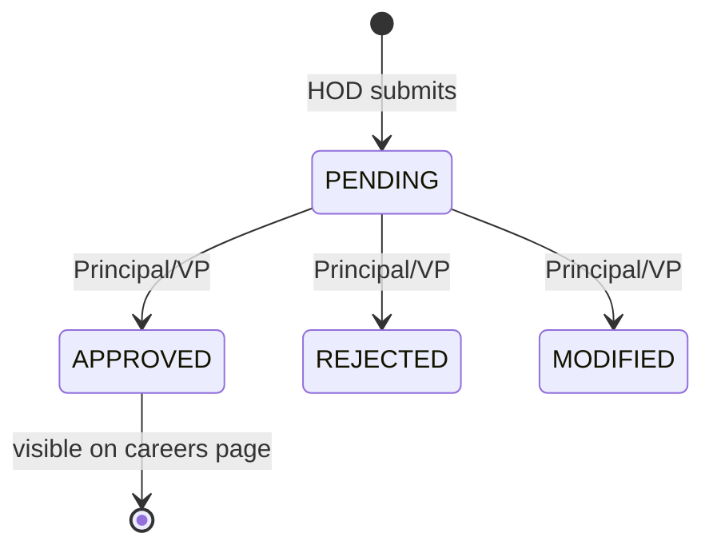
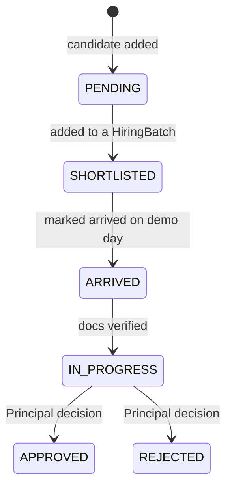
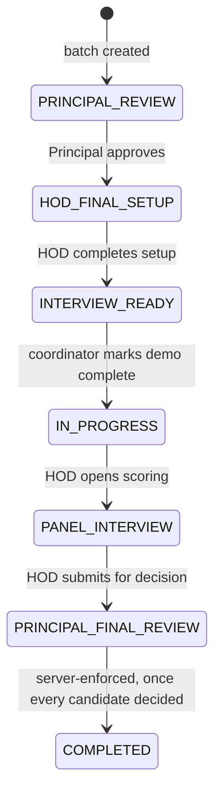
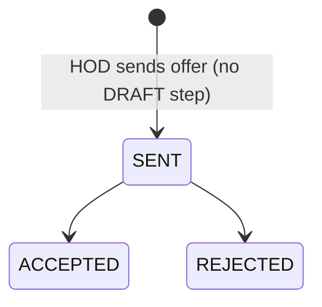

# Hiring Pipeline - Architecture Analysis

Solution-architect level view of recruitment in the FMS: how the pieces fit together, where the state lives, and what's structurally risky. For an exhaustive route-by-route trace (every endpoint, guard, and field write), see [`HIRING_WORKFLOW.md`](../HIRING_WORKFLOW.md) at the repo root - this doc doesn't repeat that table, it sits a level above it.

## 1. The core fact: three pipelines, not one

AGENTS.md describes recruitment as a single flow ("vacancy request → approval (HR/Admin) → hiring batch + interviews → decision → offer letter → faculty provisioning"). In the actual codebase that sentence describes **one of three independent pipelines** that share nothing but the `UserRole` type - no shared state machine, no shared service layer, no cross-links between their Firestore documents.



| | Pipeline A (College) | Pipeline B (Location) | Pipeline C (General Admin) |
|---|---|---|---|
| Tenancy | `colleges/{collegeId}/…` | `locations/{locationId}/…` | global (`generalAdminVacancies`) |
| Actors | HOD → Principal/VP → College Office → Panel → Principal → HOD | Location Dept Head → HR Admin → Administration | Vice Principal → Super Admin |
| Candidates / interviews / panel scoring | Yes - full machinery | Yes - simpler, no batches | No |
| Ends in a hired faculty account | **Yes** (only pipeline that does) | No - stops at offer approval | No - vacancy approval only |
| Backing "batch" concept | `HiringBatch` (7-phase state machine) | none | none |

**Why this matters architecturally**: AGENTS.md's single-flow description is the one an engineer would design *today*, given the role model (`LOCATION_DEPT_HEAD`/`HR_ADMIN`/`ADMINISTRATION` at L2, `PRINCIPAL`/`HOD` at L3–L4). What exists is evidence of two builds that never got reconciled - Pipeline A is the one actually driving hires (it's the only one that provisions a `FacultyMember`), Pipeline B duplicates the same shape one tenancy level up and dead-ends. Anyone extending recruitment should treat **Pipeline A as canonical** and budget for a decision on Pipeline B (merge into A, or explicitly scope it to something A doesn't do - see §6).

## 2. Pipeline A - sequence



## 3. State machines


*VacancyRequest.status*


*Candidate.status - `currentStage` runs `DEMO → INTERVIEW → DOCUMENT_VERIFICATION → DECISION` in parallel (`SALARY_NEGOTIATION` is declared but never reached - CTC is just a field on the offer)*


*HiringBatch.currentPhase - 7 states actually reachable (the type's doc-comment references a "9-phase workflow"; that's stale)*


*OfferLetter.status - `DRAFT`/`GENERATED` are declared on the type but never written*

## 4. Role responsibility matrix (Pipeline A)

| Role | Vacancy | Candidates/Batch | Setup | Scoring | Decision | Offer/Provisioning |
|---|---|---|---|---|---|---|
| **HOD** | Raises | Adds candidates, creates batch, final setup, coordinator | Coordinator handoff | Scores if on panel | - | Sends offer, sets faculty credentials |
| **Principal / VP** | Approves/rejects | Approves interview plan | - | - | Approves/rejects each candidate | Can also send offers |
| **College Office** | - | - | Venue + required docs, document verification | - | - | - |
| **Coordinator** (a `PANEL_MEMBER`) | - | - | Runs demo day, QR feedback, marks demo complete | - | - | - |
| **Panel Member** | - | - | - | Scores technical/comms/teaching | - | - |
| **Super Admin** | Full override at every step (present on nearly every guard) | | | | | |

Notably absent from this list: `HR_ADMIN`, `ADMINISTRATION`, `ACCOUNTS` (`ACCOUNTS` gets read-only access to candidates/HR-feedback, an odd carve-out since it's otherwise a LOCATION-scoped role reading COLLEGE-scoped data - hardcoded into the route guard, not derived from `ROLE_SCOPE`). There is **no HR/Admin approval step in Pipeline A at all**, despite that being the exact phrase AGENTS.md uses to describe "the" recruitment flow - that step exists only in Pipeline B.

## 5. Data model

```
colleges/{collegeId}/
  vacancyRequests/{id}        - WorkflowStatus: PENDING → APPROVED|REJECTED|MODIFIED
  candidates/{id}             - status + currentStage, batchId back-reference
  hiringBatches/{id}
    panelFeedback/{id}        - subcollection, one per (panelUid, candidateId)
    studentFeedback/{id}      - subcollection, anonymous
    hrFeedback/{id}           - subcollection, API works, no UI reaches it
  hiringDocVerifications/{id} - type/collection exist, fully unused
  offerLetters/{id}           - status: (created)→SENT→ACCEPTED|REJECTED
  appointmentLetters/{id}     - type/template exist, never written
  facultyMembers/{id}         - provisioning target; canonical faculty record
  users/{uid}                 - login profile; provisioned with role=PANEL_MEMBER
  notifications/{id}
  auditLogs/{id}

locations/{locationId}/
  locationVacancyRequests/{id} - PENDING_HR → PENDING_ADMIN → APPROVED|REJECTED
  locationCandidates/{id}
  locationInterviews/{id}
    feedback/{id}              - NBA/NAAC-style 70/30 weighted score
  locationOffers/{id}

generalAdminVacancies/{id}     - top-level, not nested; PENDING → APPROVED|REJECTED

systemUsers/{uid}              - global uid→role/collegeId/locationId map, updated by provisioning
```

Public/unauthenticated write surfaces: `careers/[collegeId]` (candidate application, direct client-SDK write), `POST /api/public/student-feedback` (anonymous demo scoring), and the `bioData` branch of `PATCH /api/location/candidates/[id]` (see §6, Finding 1).

## 6. Findings, ranked

**1 - Unauthenticated write on `locationCandidates` bio-data (Security, High)**
`PATCH /api/location/candidates/[id]`'s bio-data branch has no auth check by design - the route comment says as much ("public form uses candidateId token"). Anyone who obtains or guesses a `locationCandidates` document ID can overwrite `bioData` (Aadhaar, PAN, salary, address) on it. Firestore doc IDs are not secrets. Fix: gate on a signed, single-use token issued when the candidate is invited, not the raw doc ID.

**2 - Client-side-only batch completion, race-prone employee IDs (Correctness, Medium)**
The research trace found the server *does* now auto-complete a `HiringBatch` once every candidate is decided (contradicts the root doc's note that this is client-only - verify which is current before relying on either). Separately, `employeeId` generation uses a `.count()` aggregation read-then-write with no transaction - two offers provisioned back-to-back could theoretically collide. Low practical risk given hiring throughput, but worth a Firestore transaction if it's ever bulk-processed.

**3 - Type/data drift across the recruitment types (Maintainability, Medium)**
Several routes write string literals that aren't members of the TS unions they're nominally typed against - silent because Firestore doesn't enforce them at write time:
- `NotificationType`: routes write `"OFFER_LETTER_CREATED"`, `"VACANCY_REQUEST"`, `"INTERVIEW_PLAN_PENDING"` - none exist in the union (`core.ts:717-770`).
- `PositionCategory`: Location pipeline hardcodes `"FACULTY"`, not a member of `TEACHING | SUPPORTING_STAFF | GENERAL_ADMIN`.
- `EmploymentType`: faculty provisioning writes `"FULL_TIME"`, not a member of `PERMANENT | CONTRACT | VISITING | PART_TIME`.

These are UI-cosmetic today (labels just render blank/fallback) but will surprise the next person who trusts the type as ground truth. A quick pass reconciling actual write-site literals against the unions (or vice versa) would close this for good.

**4 - Dead/unreachable capability (Simplicity, Low-Medium)**
`HRFeedback` API is fully implemented server-side with no UI ever calling it; `HiringDocVerification` type/collection is entirely unused (doc verification runs ad hoc through `Candidate.currentStage`, duplicated across two College Office pages); `AppointmentLetter` type + PDF template exist but nothing ever creates one; `src/lib/firestore/hiring.ts` (429 lines) and `src/hooks/useHiring*.ts` are legacy client-SDK scaffolding with a single live caller (`createCandidate` on the public careers page) - everything else routes through server API handlers instead. None of this is broken, but AGENTS.md pointing to `src/lib/firestore/hiring.ts` as "shared logic" will send the next engineer down a dead end. Recommend either wiring HR feedback into the decision-aggregation UI (it's already read there) or deleting the route; same call for `HiringDocVerification`/`AppointmentLetter` - build the UI or delete the scaffolding.

**5 - Pipeline B has no faculty-provisioning terminus (Architecture, Medium)**
If Pipeline B (Location hiring) is meant to produce hired staff the same way Pipeline A does, it currently can't - it stops at `locationOffers.status: APPROVED`. Either it's intentionally scoped to something else (e.g., a pre-screening funnel that hands off to Pipeline A manually - not evidenced anywhere in the code) or it's an incomplete parallel build. Worth a product decision, not a code fix.

**6 - Generated faculty password isn't delivered (UX/Ops, Low)**
`provisionFacultyFromOffer()` returns a one-time generated password shown to the HOD in a dialog; it's never emailed or stored. If the HOD closes the dialog without noting it down, the only recovery path is Firebase Auth password reset - not itself a bug, but worth confirming that's the intended support path.

## 7. Recommendations, in order of leverage

1. Update AGENTS.md's recruitment paragraph to name Pipeline A specifically and flag Pipeline B/C as separate, since the current wording reads as one unified flow and will misdirect anyone using it as a map.
2. Close the unauthenticated bio-data write (Finding 1) - the only item here with real exposure.
3. Decide Pipeline B's fate (Finding 5) - merge, scope, or deprecate - before more is built on top of it.
4. Reconcile the type-drift literals (Finding 3) in one pass; cheap now, gets more expensive the longer mismatched strings accumulate in production data.
5. Delete or finish the dead capabilities (Finding 4) - `HRFeedback`, `HiringDocVerification`, `AppointmentLetter`, and the legacy `src/lib/firestore/hiring.ts`/`useHiring*` hooks are each a "why does this exist" question waiting for the next engineer.
