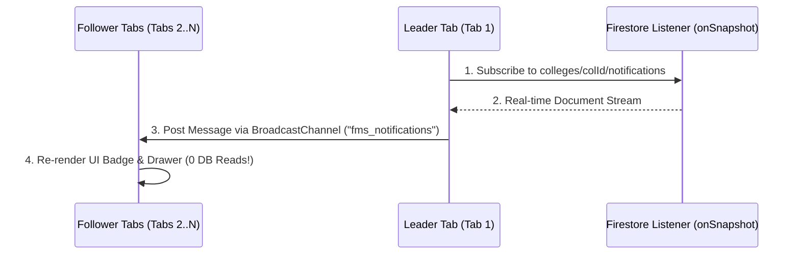

# Interoperable Event-Driven Notification System Architecture

**System:** Multi-Tenant Faculty Management & Institutional Operations Platform (FMS)  
**Architectural Standard:** SOLID Principles | Event-Driven Architecture (EDA) | Topic-Based Fan-Out | Clean Abstraction Layers  

---

## 1. Current Notification System Audit & Bottlenecks

### 1.1 Current Architecture & Coupling Map
Currently, notification dispatch is **tightly coupled** directly inside domain workflow functions (`src/lib/notify.ts`, `src/lib/circular/service.ts`, `src/lib/leave/decideFinalStage.ts`, `src/lib/budget/managementApproval.ts`):

```mermaid
flowchart TD
    subgraph Current Tightly Coupled Flow
        A[Domain Action: publishCircular / approveLeave / createBudget] --> B[Inline API Handler]
        B -->|Direct Sync Call| C[notify / notifyRole / notifyCircularAudience]
        C -->|Sequential Loop| D[(Firestore Document Writes: add())]
        C -->|Inline Call| E[sendMail / SMTP]
    end
```

### 1.2 Identified Limitations in Current Design
1. **Violation of Single Responsibility Principle (SRP):** Business functions (e.g., approving a leave or publishing a circular) are responsible for database mutations **AND** resolving recipient roles **AND** formatting notifications **AND** performing database writes.
2. **Violation of Open/Closed Principle (OCP):** Adding a new delivery channel (e.g., FCM Mobile Push, SMS, WhatsApp) requires editing every single call site across 15+ API routes.
3. **Violation of Dependency Inversion Principle (DIP):** Domain modules depend directly on concrete Firebase Admin SDK functions (`db.collection().add()`) and `nodemailer`.
4. **Latency & Scalability Bottlenecks:** $N$ individual network HTTP write requests executed during user API request handlers block HTTP responses for 2–5 seconds.

---

## 2. Proposed Interoperable Event-Driven Architecture (EDA)

The proposed design establishes clean **SOLID Abstraction Layers** and a **Topic-Based Event Bus**.

```mermaid
flowchart TD
    subgraph 1. Domain Event Emission (DIP Compliant)
        M1[Leave Module] -->|Publish Event| EB[IEventBus / EventBus]
        M2[Circulars Module] -->|Publish Event| EB
        M3[Budget Module] -->|Publish Event| EB
        M4[Attendance Module] -->|Publish Event| EB
    end

    subgraph 2. Topic Router & Audience Resolver Engine (SRP / ISP)
        EB -->|Domain Event| TR[Topic Router & Registry]
        TR -->|Resolve Topics| AR[IAudienceResolver]
        AR -->|Role Seats & Delegates| R1[Seat & Delegate Provider]
        AR -->|Target Recipient UIDs| FO[Fan-Out Engine]
    end

    subgraph 3. Pluggable Channel Providers (OCP / LSP)
        FO -->|ID: eventId_uid| CP[Channel Dispatcher]
        CP -->|In-App Provider| P1[InAppNotificationChannel]
        CP -->|Push Provider| P2[FCMPushNotificationChannel]
        CP -->|Email Provider| P3[EmailNotificationChannel]
    end

    subgraph 4. Storage & Client Sync
        P1 -->|WriteBatch 500/chunk| FS[(colleges/colId/notifications)]
        FS -->|onSnapshot| LT[Leader Browser Tab]
        LT -->|BroadcastChannel API| FT[Follower Browser Tabs]
    end
```

---

## 3. SOLID Abstraction Layers & Interface Contracts

### 3.1 Domain Event Contract (`src/core/events/types.ts`)
Domain events represent immutable facts emitted by system actions.

```typescript
export interface IDomainEvent<T = Record<string, unknown>> {
  readonly eventId: string;        // UUID / Unique Event ID (Idempotency Key)
  readonly eventType: string;      // e.g. "circular.published", "leave.approved"
  readonly collegeId: string;
  readonly topic: string;          // Target Topic (e.g., "role:HOD", "dept:BS_MATHS", "user:UID")
  readonly actor: {
    uid: string;
    name: string;
    role: string;
  };
  readonly payload: T;
  readonly createdAt: string;      // ISO 8601 Timestamp
}
```

### 3.2 Interfaces & Contracts (`src/core/events/contracts.ts`)

```typescript
// 1. Dependency Inversion: Modules depend on IEventBus abstraction
export interface IEventBus {
  publish<T>(event: IDomainEvent<T>): Promise<void>;
  subscribe(eventType: string, handler: IEventHandler): void;
}

export interface IEventHandler<T = Record<string, unknown>> {
  handle(event: IDomainEvent<T>): Promise<void>;
}

// 2. Single Responsibility: Audience Resolution
export interface IAudienceResolver {
  resolveTopic(collegeId: string, topic: string): Promise<string[]>;
}

// 3. Open/Closed & Liskov Substitution: Pluggable Channel Providers
export interface INotificationPayload {
  eventId: string;
  collegeId: string;
  toUid: string;
  type: string;
  title: string;
  message: string;
  link?: string | null;
  metadata?: Record<string, unknown>;
}

export interface INotificationChannelProvider {
  readonly channelName: string; // "in_app" | "fcm_push" | "email"
  send(notifications: INotificationPayload[]): Promise<void>;
}
```

---

## 4. Topic Routing & Fan-Out Architecture

### 4.1 Topic Naming Standard (`src/core/events/topics.ts`)
The Topic Router standardizes audience targeting across all modules:

| Topic Pattern | Description | Example | Target Recipients |
| :--- | :--- | :--- | :--- |
| `user:{uid}` | Direct User Notification | `user:usr_99812` | Single specific user document |
| `role:{roleName}` | Primary Role + Seat Holders + Delegates | `role:HOD`, `role:PRINCIPAL` | Role users + Seat holders + Active leave delegates |
| `dept:{deptName}` | Department Staff & Head | `dept:COMPUTER_SCIENCE` | All department staff and its HOD |
| `scope:{employeeType}` | Employment Classification | `scope:TEACHING`, `scope:NON_TEACHING` | Filtered role set by employment scope |
| `college:{collegeId}` | Full Institutional Broadcast | `college:col_eng_01` | All active users in the college |

### 4.2 Audience Resolution & Edge Cases (`src/core/events/resolvers.ts`)
The `AudienceResolver` seamlessly handles complex institutional edge cases:
1. **Seat Holders Resolution:** When targeting `role:PRINCIPAL` or `role:HOD`, `findUsersByRoles()` checks both primary roles AND assigned seat roles (`types/roleSeats.ts`).
2. **Leave Delegation Resolution:** Resolves active delegates (`findActiveDelegates`) for roles whose primary holder is currently on approved leave.
3. **Leadership Filter Exclusions:** Automatically strips executive leadership (`PRINCIPAL`, `VICE_PRINCIPAL`, `DIRECTOR`) from panel-level operational notifications when configured.
4. **Idempotent Document Keying:** Document IDs are generated deterministically as `${eventId}_${toUid}`. Retries or duplicate events update existing records rather than producing duplicate notifications.

---

## 5. Channel Providers Implementation

### 5.1 In-App Firestore Provider (`src/core/notifications/providers/InAppProvider.ts`)
Uses Firestore `WriteBatch` to commit notifications in **chunks of 500 documents per batch**, eliminating $N+1$ network roundtrips.

```typescript
export class InAppNotificationChannelProvider implements INotificationChannelProvider {
  readonly channelName = "in_app";

  constructor(private db: FirebaseFirestore.Firestore) {}

  async send(notifications: INotificationPayload[]): Promise<void> {
    if (notifications.length === 0) return;

    for (let i = 0; i < notifications.length; i += 500) {
      const chunk = notifications.slice(i, i + 500);
      const batch = this.db.batch();

      for (const n of chunk) {
        // Deterministic Idempotent Document ID
        const docRef = this.db
          .collection("colleges")
          .doc(n.collegeId)
          .collection("notifications")
          .doc(`${n.eventId}_${n.toUid}`);

        batch.set(docRef, {
          collegeId: n.collegeId,
          toUid: n.toUid,
          type: n.type,
          title: n.title,
          message: n.message,
          link: n.link ?? null,
          read: false,
          createdAt: new Date(),
        }, { merge: true });
      }

      await batch.commit();
    }
  }
}
```

### 5.2 FCM Push Provider (`src/core/notifications/providers/FCMPushProvider.ts`)
Sends Firebase Cloud Messaging push alerts to mobile devices/PWA subscribers asynchronously without delaying the main HTTP response.

---

## 6. Client-Side Leader Election & Tab Broadcast

To stop database usage drain on client browsers, `useNotifications` integrates Web `BroadcastChannel`:



---

## 7. Migration & Implementation Checklist

| Phase | Milestone | Files / Modules Affected | Impact |
| :--- | :--- | :--- | :--- |
| **Phase 1** | **Core Abstractions & Event Bus** | `src/core/events/types.ts`<br>`src/core/events/bus.ts` | Introduces `IEventBus`, `IDomainEvent`, and Event Registry |
| **Phase 2** | **Topic Router & Audience Resolvers** | `src/core/events/topics.ts`<br>`src/core/events/resolvers.ts` | Centralizes Role Seats, Delegates, and Leadership exclusion logic |
| **Phase 3** | **Pluggable Channel Providers** | `src/core/notifications/providers/` | Implements In-App `WriteBatch` (500/chunk), FCM Push, and Email |
| **Phase 4** | **Module Interoperability Integration** | `src/lib/circular/service.ts`<br>`src/lib/leave/decisionTx.ts`<br>`src/lib/budget/` | Business modules emit events via `EventBus` (0 direct `notify()` calls) |
| **Phase 5** | **Client Tab Broadcast Sync** | `src/lib/notifications/liveFeed.ts` | Elects Leader Tab using Web `BroadcastChannel` (90% client read savings) |

---
*Report generated autonomously by Antigravity Solution Architecture Agent.*
